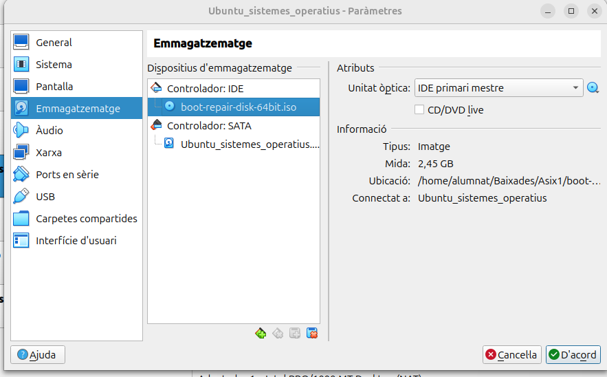
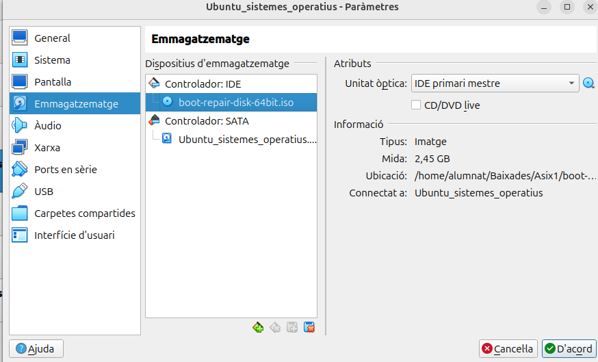

# Robert Daniel Miron
## 1r ASIX

### [1. Instal·lació sistema operatiu](sistema-operatiu.md)

Aqui afegim la ISO del Ubuntu 24.04.1

Aqui a la Xarxa de la nostra maquina virtual la fiquem en Xarxa NAT

Començem la instalació del ubuntu 

Ho deixe com esta i li donem a siguiente

Selecionem el nostre idioma del teclat i seguim amb la instal·lació

Instalar Ubuntu i seguim

Instal·lació manual i sigüent

Aqui ve lo mes important les particions del disc  creem 4sda com veiem a la imatge en els espai corresponents.

Fiquem el nostre nom d'usuari i contrasenya

Ja hem acabat de configurar la instal·lació apretem a instal·lar i esperem a que acabi i ja el tindrem instal·lat.

### [2. Punts de restauració](punts-restauracio.md)
Contingut 

### [3. LLlicència](llicenciament.md)
-CC(Creative Commons): Contingut digital

**-El Programari Lliure:** (en anglès, Free Software) es refereix a qualsevol tipus de programari que respecta la llibertat dels usuaris i les comunitats per executar-lo, estudiar-lo, modificar-lo i redistribuir-lo. El terme va ser encunyat per Richard Stallman el 1983 en el marc del projecte GNU i s'ha convertit en un moviment tecnològic i social.

 Les quatre llibertats fonamentals del Programari Lliure són:

    -Llibertat d'executar el programa 

    -Llibertat d'estudiar com funciona el programa

    -Llibertat de redistribuir còpies 

    -Llibertat de millorar el programa

-Ubuntu Llicencia de la maquina instal·lada

### [4. Gestió d'arrancada](gestors-darrancada.md)
Bootrepair

RESTARTEEM LA MAQUINA

JA NO ARRANCA PER EL QUE HEM ELIMINAT

AFEGIM LA ISO DEL BOOT REPAIR I INICIEM

### [5. Configuració xarxa bàsica](Configuracio-xarxa-basica.md)
Contingut 

### [6. Instal·lacions de programari](Instalacions-de-programari.md)
Contingut

[Esta obra está bajo la licencia Creative Commons Atribución 4.0](https://creativecommons.org/licenses/by/4.0/).

[Esta obra está bajo la licencia Creative Commons Atribución 4.0](https://creativecommons.org/licenses/by-nd/4.0/).

