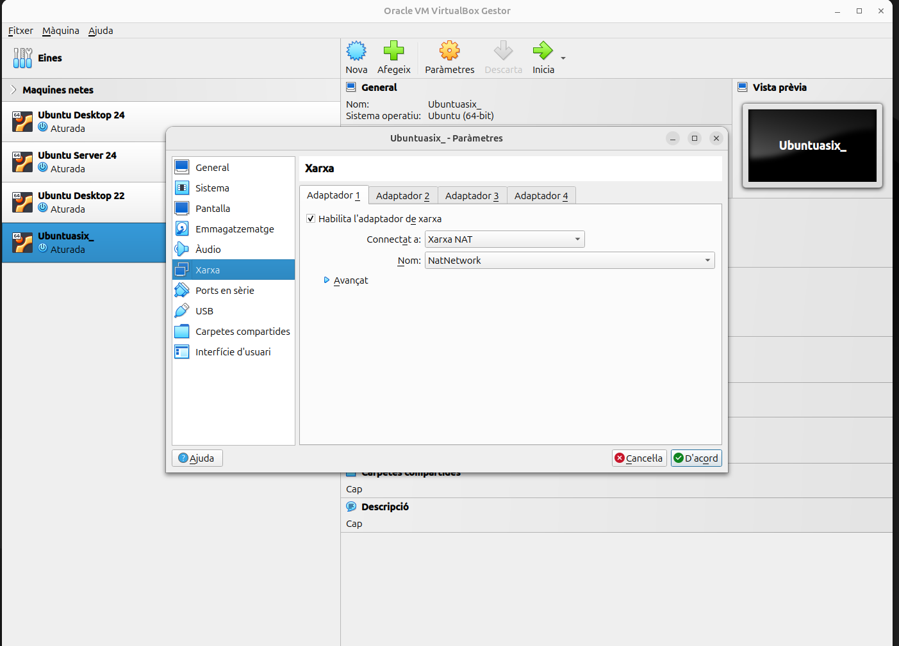
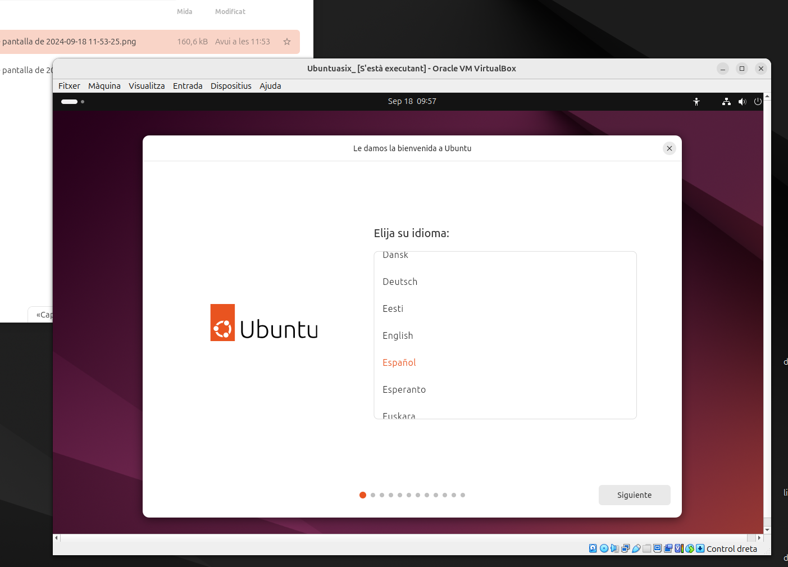
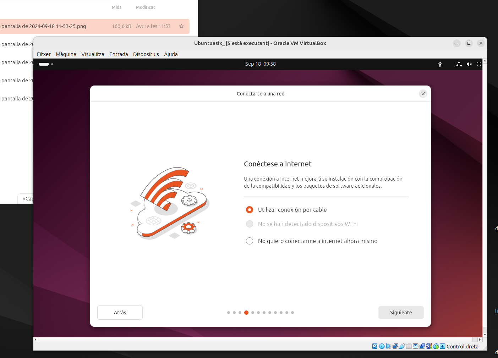
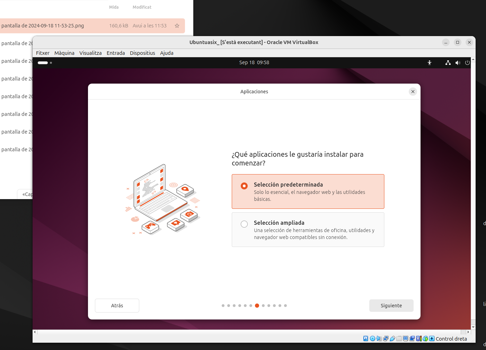
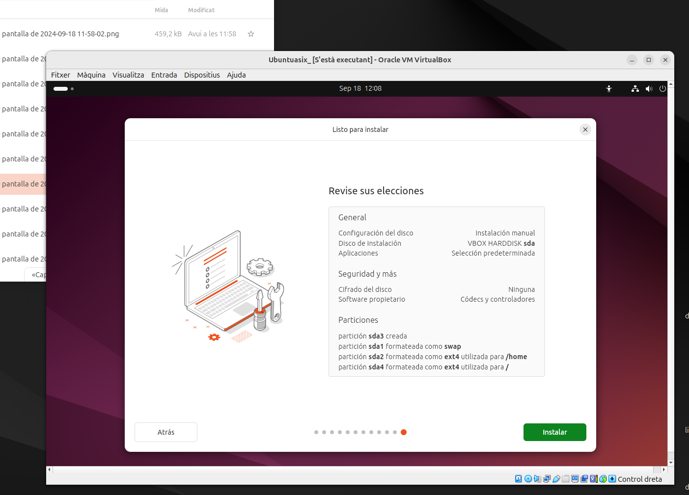

# Robert Daniel Miron
## 1r ASIX

### [1. Sistema operatiu](sistema-operatiu.md)

Aqui afegim la ISO del Ubuntu 24.04.1

Aqui a la Xarxa de la nostra maquina virtual la fiquem en Xarxa NAT

Contingut 
